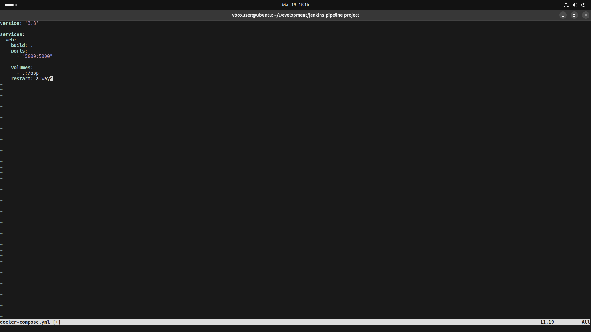
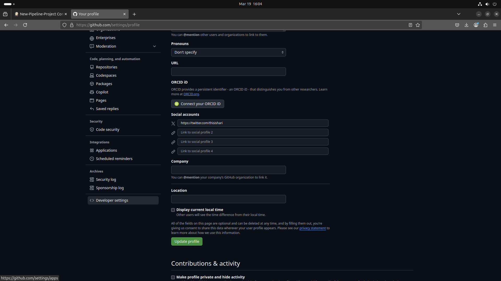

# Setting up a pipeline project in Jenkins

**Day - 2**

24MCR029  
Harikrishnan N 

---

## Installing docker.io

---

## Installing docker-compose

---

## Creating a simple python flask application and running it using docker

---

## Contents of app.py

---

## Contents of dockerfile

---

## Contents of docker-compose.yml

---

## Contents of requirements.txt

---

## Overall project files

---

## Building an image using docker-compose

---

## Flask application now running inside docker container

---

## GitHub Personal Access Token Generation 1

---

## GitHub Personal Access Token Generation 2

---

## GitHub Personal Access Token Generation 3

---

## GitHub Personal Access Token Generation 4

---

## GitHub Personal Access Token Generation 5

---

## GitHub Personal Access Token Generation 6

---

## Creating a pipeline project with Jenkins and dockerhub

---

## Configuring pipeline script 1

---

## Configuring pipeline script 2

---

## Configuring pipeline script 3

---

## Configuring pipeline script 4

---

## Configuring pipeline script 5

---

## SignIn with docker hub

---

## Add docker credentials in global credentials

---

## Adding docker credentials

---

## Global credentials

---

## Appending Jenkins and docker in groups

---

## Restarting Jenkins services

---

## Creating Jenkinsfile to our local repo

---

## Adding Jenkinsfile configuration 1

---

## Adding Jenkinsfile configuration 2

---

## Adding Jenkinsfile configuration 3

---

## Adding Jenkinsfile configuration 4

---

## Adding Jenkinsfile configuration 5

---

## Adding Jenkinsfile configuration 6

---

## Jenkins Dashboard

---

## build now - New-Pipeline-project

---

## Building New-Pipeline-project script

---

## Build Status

---

## Build Completed

---

## Flask application running on port 5001 now

---

## Flask running container can be seen in the docker hub dashboard

---

_End of day 2 assignment_
